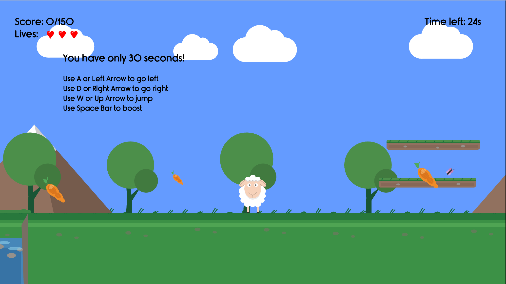
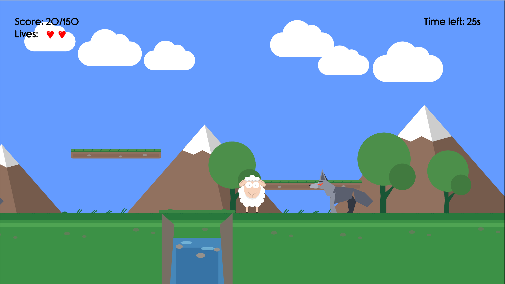

# Sheep Run (p5.js Platformer)

A side-scrolling platform game built with `p5.js` and `p5.sound`, starring a sheep.

Repository: https://github.com/dxit/sheep-run-game  
Live game: https://dxit.github.io/sheep-run-game/


_Gameplay overview._


_Enemy encounter with a wolf._

## Features

- Scrollable world with camera follow and world bounds
- Procedurally generated level elements (clouds, mountains, trees, canyons, platforms, wolves, butterflies, carrots)
- Multiple game states: active run, game over, level completed
- Lives, score, and optional timer system
- Best-time tracking for completed runs
- Sound effects and background music
- Faster startup: deferred script loading and lazy-loaded background music
- Built-in loading overlay while assets initialize
- Carrots as core collectables
- Butterfly bonuses: time butterfly (pink, `+10s`) and life butterfly (gold, `+1 life`)
- Butterfly spawning is guaranteed every run (with platform safety fallback)
- TypeScript modular architecture (`entities`, `managers`, `utils`) powered by Vite

## Controls

- `A` or `Left Arrow`: move left
- `D` or `Right Arrow`: move right
- `W` or `Up Arrow`: jump
- `Space`: boost in movement direction
- `Esc`: restart (after game over or level completion)

## Run Locally

Clone or download this project, then use Vite from the project root.

```bash
npm install
npm run dev
```

Open the URL shown in terminal (usually `http://localhost:5173`).

### Production Build

```bash
npm run build
npm run preview
```

## Run Tests

```bash
npm run test
```

## Project Structure

```text
.
├── assets/
│   ├── fonts/
│   └── sounds/
├── docs/
│   └── images/
│       ├── sheep-run-enemy-encounter.png
│       └── sheep-run-gameplay.png
├── public/
│   ├── p5.min.js
│   └── p5.sound.min.js
├── index.html
├── package.json
├── src/
│   ├── entities/
│   │   ├── Enemy.ts
│   │   └── Platform.ts
│   ├── managers/
│   │   ├── CharacterManager.ts
│   │   ├── FontManager.ts
│   │   ├── GameManager.ts
│   │   ├── LevelManager.ts
│   │   ├── PaletteManager.ts
│   │   └── SoundManager.ts
│   └── utils/
│       ├── LoaderOverlay.ts
│       └── Utility.ts
├── tests/
│   └── Utility.test.ts
├── sketch.ts
├── tsconfig.json
├── vite.config.ts
└── CREDITS.md
```

## Tech Stack

- `TypeScript`
- `p5.js`
- `p5.sound`
- `Vite`
- `Vitest`

## Credits

- Audio credits: [CREDITS.md](CREDITS.md)
